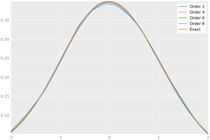

# HigherOrderKernels

This package provides basic kernel density estimation using *higher order kernels* also known as *bias reducing kernels*.
At the moment only kernels from the polynomial family described in [1]. This includes some widely used kernels:

* Uniform
* Epanechnikov
* Biweight
* Triweight

and higher order versions. Kernel code is generated automatically, so any order is possible.

For bandwidht selection, Silverman's rule-of-thumb is implemented for all kernels.

# Example

```julia
using HigherOrderKernels
using Plots
using Distributions

data = randn(10000)
xgrid = linspace(-2, 2, 100)
plt = plot()
for ν = 2:2:8
  k = EpanechnikovKernel{ν}
  h = bandwidth(k, data)
  p = kpdf.(k, xgrid, [data], h)
  plot!(plt, xgrid, p, label="Order $ν")
end
plot!(x -> pdf(Normal(), x), label="Exact")
```



# References
1. Hansen, B. E. (2005). EXACT MEAN INTEGRATED SQUARED ERROR OF HIGHER ORDER KERNEL ESTIMATORS. Econometric Theory, 21(6), 1031–1057. http://doi.org/10.1017/S0266466605050528
